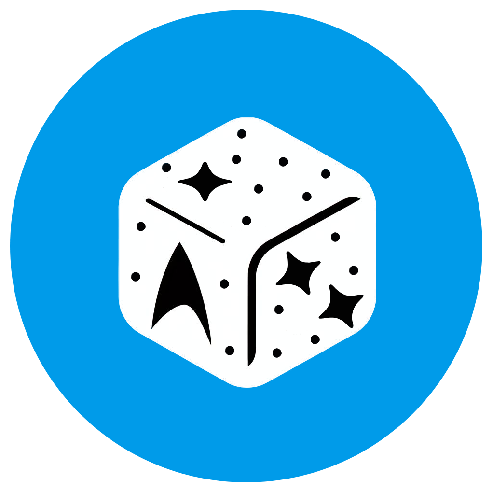
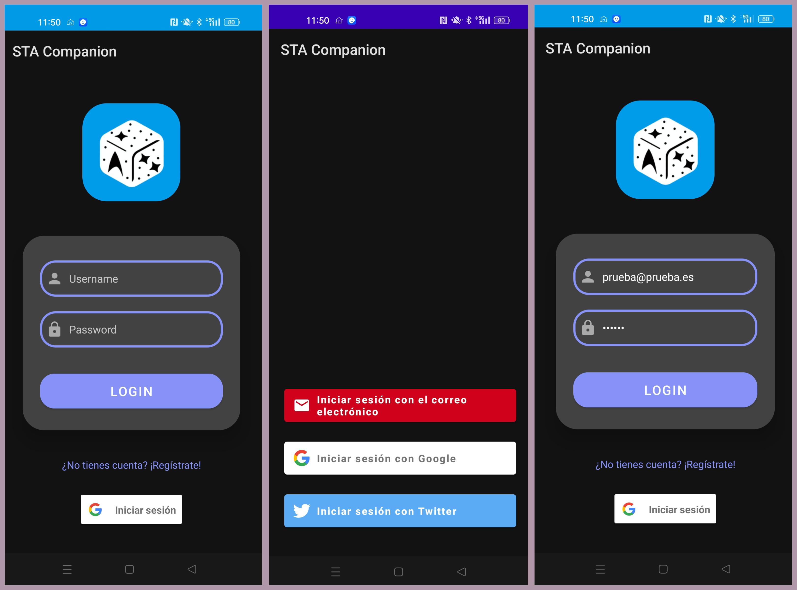
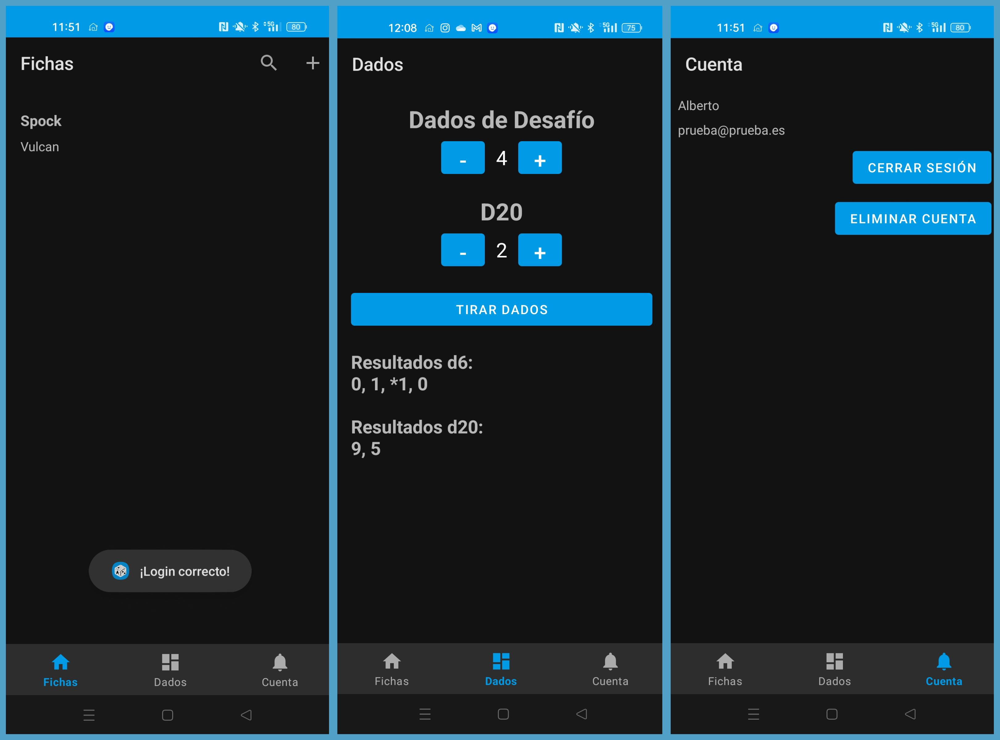
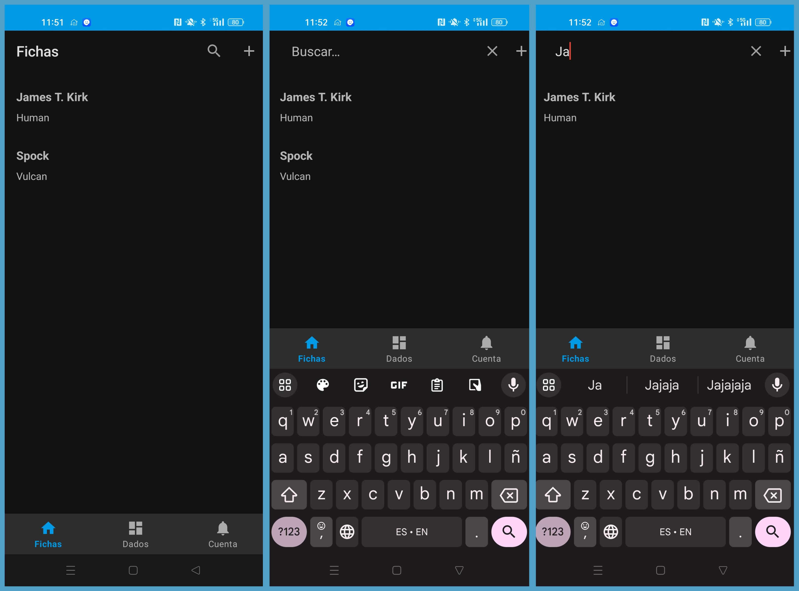

<p align="center">
  
</p>

<p align="center">
    <h1 align="center">STA Companion App</h1>
</p>
<p align="center">
    <h3 align="center">A companion app for the <a href="https://www.modiphius.net/collections/star-trek-adventures">Star Trek Adventures</a> tabletop RPG.</h3>
</p>
<p align="center">
	
	
	
	
<p align="center">
		<em>Developed with the software and tools below.</em>
</p>
<p align="center">
	
	
</p>
<hr>

##  Quick Links

> - [ Overview](#-overview)
> - [ Features](#-features)
> - [ Repository Structure](#-repository-structure)
> - [ Modules](#-modules)
> - [ Getting Started](#-getting-started)
    >   - [ Installation](#-installation)
>   - [ Running STACompanion](#-running-STACompanion)
>   - [ Tests](#-tests)
> - [ Project Roadmap](#-project-roadmap)
> - [ Contributing](#-contributing)
> - [ License](#-license)
> - [ Acknowledgments](#-acknowledgments)

---

##  Overview

STA Companion App is a companion application for Android devices for the Star Trek Adventures tabletop RPG. It allows players to manage their characters and starships, perform special dice rolls, and export their character and starship sheets to PDF.

This project was conceived as the capstone for the CFGS Multiplatform Application Development course. It leverages Firebase for user authentication and data storage, serving as a practical exploration of Google's APIs.

<details closed>
    <summary>Screenshots</summary>

</br>







</details>

---

##  Features

- **Character Sheets**: Manage your character's stats, inventory, and more.
- **Starship Sheets**: Keep track of your starship's stats and inventory.
- **Special Star Trek Adventures Dice Rolls**: Perform special dice rolls unique to Star Trek Adventures.
- **Export Sheets to PDF**: Export your character and starship sheets to PDF for easy sharing and printing.
- **Firebase Authentication**: Securely log in to the app using Firebase Authentication.
- **Firebase Realtime Database**: Store and retrieve data in real time with Firebase's NoSQL cloud database.
- **Selectable Design**: Choose between red, blue, and gold themes to customize the app's appearance.

---


##  Repository Structure

<details closed>
    <summary>Files & folders</summary>

```sh
.
└── STACompanion
    ├── app
    │   ├── build.gradle.kts
    │   ├── proguard-rules.pro
    │   ├── release
    │   │   ├── app-release.aab
    │   │   ├── app-release.apk
    │   │   └── output-metadata.json
    │   ├── src
    │   │   ├── androidTest
    │   │   │   └── java
    │   │   │       └── io
    │   │   │           └── github
    │   │   │               └── k3ssdev
    │   │   │                   └── stacompanion
    │   │   │                       └── ExampleInstrumentedTest.java
    │   │   ├── google-services.json
    │   │   ├── main
    │   │   │   ├── AndroidManifest.xml
    │   │   │   ├── assets
    │   │   │   │   ├── STA_personaje.pdf
    │   │   │   │   └── Stardate81316-aolE.ttf
    │   │   │   ├── ic_launcher-playstore.png
    │   │   │   ├── java
    │   │   │   │   └── io
    │   │   │   │       └── github
    │   │   │   │           └── k3ssdev
    │   │   │   │               └── stacompanion
    │   │   │   │                   ├── data
    │   │   │   │                   │   ├── CharacterFragmentAdapter.java
    │   │   │   │                   │   ├── CharacterSheet.java
    │   │   │   │                   │   ├── SheetSettings.java
    │   │   │   │                   │   └── Starship.java
    │   │   │   │                   ├── LegalActivity.java
    │   │   │   │                   ├── LoginActivity.java
    │   │   │   │                   ├── MainActivity.java
    │   │   │   │                   ├── ui
    │   │   │   │                   │   ├── characters
    │   │   │   │                   │   │   ├── CharactersFragment.java
    │   │   │   │                   │   │   ├── charactersheet
    │   │   │   │                   │   │   │   ├── CharacterSheetFragment.java
    │   │   │   │                   │   │   │   ├── DataTabFragment.java
    │   │   │   │                   │   │   │   ├── OthersFragment.java
    │   │   │   │                   │   │   │   ├── SkillsFragment.java
    │   │   │   │                   │   │   │   └── StatusFragment.java
    │   │   │   │                   │   │   ├── CharacterSheetEditActivity.java
    │   │   │   │                   │   │   └── CharacterSheetViewModel.java
    │   │   │   │                   │   ├── dice
    │   │   │   │                   │   │   ├── DiceFragment.java
    │   │   │   │                   │   │   ├── DiceResultAdapter.java
    │   │   │   │                   │   │   ├── DiceResult.java
    │   │   │   │                   │   │   ├── DiceViewModel.java
    │   │   │   │                   │   │   └── SpaceItemDecoration.java
    │   │   │   │                   │   └── settings
    │   │   │   │                   │       ├── SettingsFragment.java
    │   │   │   │                   │       └── SettingsViewModel.java
    │   │   │   │                   └── util
    │   │   │   │                       └── PdfUtil.java
    │   │   │   └── res
    │   │   │       ├── anim
    │   │   │       │   └── rotate_animation.xml
    │   │   │       ├── drawable
    │   │   │       │   ├── baseline_add_24.xml
    │   │   │       │   ├── baseline_casino_24.xml
    │   │   │       │   ├── baseline_contact_page_24.xml
    │   │   │       │   ├── baseline_delete_forever_24.xml
    │   │   │       │   ├── baseline_edit_24.xml
    │   │   │       │   ├── baseline_manage_accounts_24.xml
    │   │   │       │   ├── baseline_picture_as_pdf_24.xml
    │   │   │       │   ├── baseline_replay_24.xml
    │   │   │       │   ├── baseline_restart_alt_24.xml
    │   │   │       │   ├── baseline_sort_24.xml
    │   │   │       │   ├── custom_edittext.xml
    │   │   │       │   ├── dice20_01.xml
    │   │   │       │   ├── dice20_02.xml
    │   │   │       │   ├── dice20_03.xml
    │   │   │       │   ├── dice20_04.xml
    │   │   │       │   ├── dice20_05.xml
    │   │   │       │   ├── dice20_06.xml
    │   │   │       │   ├── dice20_07.xml
    │   │   │       │   ├── dice20_08.xml
    │   │   │       │   ├── dice20_09.xml
    │   │   │       │   ├── dice20_10.xml
    │   │   │       │   ├── dice20_11.xml
    │   │   │       │   ├── dice20_12.xml
    │   │   │       │   ├── dice20_13.xml
    │   │   │       │   ├── dice20_14.xml
    │   │   │       │   ├── dice20_15.xml
    │   │   │       │   ├── dice20_16.xml
    │   │   │       │   ├── dice20_17.xml
    │   │   │       │   ├── dice20_18.xml
    │   │   │       │   ├── dice20_19.xml
    │   │   │       │   ├── dice20_20.xml
    │   │   │       │   ├── dice6_fail.xml
    │   │   │       │   ├── dice6_special.xml
    │   │   │       │   ├── dice6_success_double.xml
    │   │   │       │   ├── dice6_success.xml
    │   │   │       │   ├── google_icon.png
    │   │   │       │   ├── ic_baseline_person_24.xml
    │   │   │       │   ├── ic_dashboard_black_24dp.xml
    │   │   │       │   ├── ic_email.xml
    │   │   │       │   ├── ic_google.xml
    │   │   │       │   ├── ic_home_black_24dp.xml
    │   │   │       │   ├── ic_launcher_background.xml
    │   │   │       │   ├── ic_launcher_foreground.xml
    │   │   │       │   ├── ic_notifications_black_24dp.xml
    │   │   │       │   ├── ic_search_black_24dp.xml
    │   │   │       │   ├── lock_76.xml
    │   │   │       │   ├── outline_file_save_24.xml
    │   │   │       │   └── rounded_button.xml
    │   │   │       ├── drawable-night
    │   │   │       │   ├── baseline_add_24.xml
    │   │   │       │   ├── baseline_casino_24.xml
    │   │   │       │   ├── baseline_edit_24.xml
    │   │   │       │   ├── baseline_replay_24.xml
    │   │   │       │   ├── dice20_01.xml
    │   │   │       │   ├── dice20_02.xml
    │   │   │       │   ├── dice20_03.xml
    │   │   │       │   ├── dice20_04.xml
    │   │   │       │   ├── dice20_05.xml
    │   │   │       │   ├── dice20_06.xml
    │   │   │       │   ├── dice20_07.xml
    │   │   │       │   ├── dice20_08.xml
    │   │   │       │   ├── dice20_09.xml
    │   │   │       │   ├── dice20_10.xml
    │   │   │       │   ├── dice20_11.xml
    │   │   │       │   ├── dice20_12.xml
    │   │   │       │   ├── dice20_13.xml
    │   │   │       │   ├── dice20_14.xml
    │   │   │       │   ├── dice20_15.xml
    │   │   │       │   ├── dice20_16.xml
    │   │   │       │   ├── dice20_17.xml
    │   │   │       │   ├── dice20_18.xml
    │   │   │       │   ├── dice20_19.xml
    │   │   │       │   ├── dice20_20.xml
    │   │   │       │   ├── dice6_fail.xml
    │   │   │       │   ├── dice6_special.xml
    │   │   │       │   ├── dice6_success_double.xml
    │   │   │       │   ├── dice6_success.xml
    │   │   │       │   ├── ic_baseline_person_24.xml
    │   │   │       │   ├── ic_email.xml
    │   │   │       │   ├── ic_search_black_24dp.xml
    │   │   │       │   ├── lock_76.xml
    │   │   │       │   └── outline_file_save_24.xml
    │   │   │       ├── layout
    │   │   │       │   ├── activity_character_sheet_edit.xml
    │   │   │       │   ├── activity_legal.xml
    │   │   │       │   ├── activity_login.xml
    │   │   │       │   ├── activity_main.xml
    │   │   │       │   ├── character_sheet_item.xml
    │   │   │       │   ├── dice_result_item.xml
    │   │   │       │   ├── fragment_account.xml
    │   │   │       │   ├── fragment_character_sheet.xml
    │   │   │       │   ├── fragment_character.xml
    │   │   │       │   ├── fragment_dice.xml
    │   │   │       │   ├── fragment_tab_sheet_data.xml
    │   │   │       │   ├── fragment_tab_sheet_others.xml
    │   │   │       │   ├── fragment_tab_sheet_skills.xml
    │   │   │       │   └── fragment_tab_sheet_status.xml
    │   │   │       ├── menu
    │   │   │       │   ├── bottom_nav_menu.xml
    │   │   │       │   ├── character_sheet_toolbar_menu_edit.xml
    │   │   │       │   ├── character_sheet_toolbar_menu.xml
    │   │   │       │   ├── dice_menu.xml
    │   │   │       │   └── toolbar_menu.xml
    │   │   │       ├── mipmap-anydpi-v26
    │   │   │       │   ├── ic_launcher_round.xml
    │   │   │       │   └── ic_launcher.xml
    │   │   │       ├── mipmap-hdpi
    │   │   │       │   ├── ic_launcher_foreground.webp
    │   │   │       │   ├── ic_launcher_round.webp
    │   │   │       │   ├── ic_launcher.webp
    │   │   │       │   ├── stacompanion_blue.png
    │   │   │       │   ├── stacompanion_logo2.png
    │   │   │       │   ├── stacompanion_logo.png
    │   │   │       │   ├── stacompanion_red.png
    │   │   │       │   └── stacompanion_yellow.png
    │   │   │       ├── mipmap-mdpi
    │   │   │       │   ├── ic_launcher_foreground.webp
    │   │   │       │   ├── ic_launcher_round.webp
    │   │   │       │   └── ic_launcher.webp
    │   │   │       ├── mipmap-xhdpi
    │   │   │       │   ├── ic_launcher_foreground.webp
    │   │   │       │   ├── ic_launcher_round.webp
    │   │   │       │   └── ic_launcher.webp
    │   │   │       ├── mipmap-xxhdpi
    │   │   │       │   ├── ic_launcher_foreground.webp
    │   │   │       │   ├── ic_launcher_round.webp
    │   │   │       │   └── ic_launcher.webp
    │   │   │       ├── mipmap-xxxhdpi
    │   │   │       │   ├── ic_launcher_foreground.webp
    │   │   │       │   ├── ic_launcher_round.webp
    │   │   │       │   └── ic_launcher.webp
    │   │   │       ├── navigation
    │   │   │       │   └── mobile_navigation.xml
    │   │   │       ├── values
    │   │   │       │   ├── colors.xml
    │   │   │       │   ├── dimens.xml
    │   │   │       │   ├── keys.xml
    │   │   │       │   ├── strings.xml
    │   │   │       │   ├── styles.xml
    │   │   │       │   └── themes.xml
    │   │   │       ├── values-es
    │   │   │       │   └── strings.xml
    │   │   │       ├── values-night
    │   │   │       │   ├── keys.xml
    │   │   │       │   ├── strings.xml
    │   │   │       │   └── themes.xml
    │   │   │       ├── values-v26
    │   │   │       │   ├── strings.xml
    │   │   │       │   └── styles.xml
    │   │   │       └── xml
    │   │   │           ├── backup_rules.xml
    │   │   │           ├── data_extraction_rules.xml
    │   │   │           └── file_paths.xml
    │   │   └── test
    │   │       └── java
    │   │           └── io
    │   │               └── github
    │   │                   └── k3ssdev
    │   │                       └── stacompanion
    │   │                           └── ExampleUnitTest.java
    │   └── stacompanion-a1286-default-rtdb-export.json
    ├── build.gradle.kts
    │   └── wrapper
    │       │          
    │       │           
    │       │           
    │       │          
    │       ├── gradle-wrapper.jar
    │       └── gradle-wrapper.properties
    ├── gradle.properties
    ├── gradlew
    ├── gradlew.bat
    ├── images
    │   ├── stacompanion_blue.png
    │   ├── stacompanion_blue_rounded.png
    │   ├── stacompanion_screenshot_1.jpg
    │   ├── stacompanion_screenshot_2.jpg
    │   └── stacompanion_screenshot_3.jpg
    ├── LICENSE
    ├── local.properties
    ├── README.MD
    ├── settings.gradle.kts
    └── sta_tree.md
```
</details>

---

##  Modules

The STA Companion App is organized into several modules:

- **app**: This is the main module of the application. It contains all the activities, fragments, view models, and other classes related to the user interface of the app.

- **data**: This module contains classes related to data handling in the app, such as data models and data sources.

- **ui**: This module contains classes related to the user interface of the app, such as custom views and adapters.

Each module has its own `build.gradle.kts` file for configuration and dependencies specific to that module.

---

## Getting Started

<details closed>
    <summary>Requirements</summary>

 - Android Studio Hedgehog
 - Android SDK 30
 - Android Build Tools v30.0.3
 - Android Emulator or Android device
 - Android 9.0 (API level 28) or higher
 - Java 8 or higher
 - Kotlin 1.4.32 or higher
 - Firebase Authentication
 - Firebase Realtime Database


 - For PDF generation, you will need to add the `STA_personaje.pdf` file to the `app/src/assets` directory. This file is included in the repository.
 - For dice rolling, you will need to add the `Stardate81316-aolE.ttf` file to the `app/src/assets` directory. This file is included in the repository.
 - For dice rolling, you will need to add the `dice20_01.xml` to `dice20_20.xml` files to the `app/src/drawable` directory. These files are included in the repository.
 - For dice rolling, you will need to add the `dice6_fail.xml`, `dice6_special.xml`, `dice6_success.xml`, and `dice6_success_double.xml` files to the `app/src/drawable` directory. These files are included in the repository.
 - For dice rolling, you will need to add the `rotate_animation.xml` file to the `app/src/anim` directory. This file is included in the repository.


 - For Firebase integration, you will need to create a Firebase project and add the `google-services.json` file to the `app/src` directory. For more information, see [Add Firebase to your Android project](https://firebase.google.com/docs/android/setup).
- You will need to fill in the `keys.xml` file located in the `app/src/res/values` directory with your Firebase server client ID and Firebase database URL. The file should look like this:

```xml
<resources>
    <string name="server_client_id">YOUR_SERVER_CLIENT_ID</string>
    <string name="firebase_database_url">YOUR_FIREBASE_DATABASE_URL</string>
</resources>

</details>


<details closed>
    <summary>Installation</summary>

To install the STA Companion App on your local machine for development and testing purposes, follow these steps:

1. **Clone the repository**

   Open your terminal and use the following command to clone the repository:

   ```sh
   git clone https://github.com/k3ssdev/STACompanion.git
    ```
2. **Navigate to the project directory**

   Change your current directory to the project's directory:

   ```sh
   cd STACompanion
   ```
3. **Sync the project**

   Open the project in Android Studio and sync the project with Gradle files. This can be done by clicking on the `Sync Project with Gradle Files` button in the toolbar or by using the `File > Sync Project with Gradle Files` option in the menu.

4. **Build the project**

   Build the project by clicking on the `Build > Make Project` option in the menu or by clicking on the `Make Project` button in the toolbar (the hammer icon).

5. **Run the project**

   Run the app by clicking on the `Run > Run 'app'` option in the menu or by clicking on the `Run` button in the toolbar (the green play icon).

Please note that you need to have Android Studio and the Android SDK installed on your machine. Also, an Android device or emulator is required for running the app.

</details>

<details closed>
    <summary>Running STA Companion</summary>

1. **Select the Run Configuration**

   In Android Studio, select the appropriate run configuration from the dropdown in the toolbar. For most cases, this will be the `app` configuration.

2. **Select the Target Device**

   Click on the `Select Target Device` button in the toolbar (next to the run configuration dropdown). This will open a dialog where you can select an Android device or emulator to run the app on. If you don't have a device connected or an emulator set up, you can create a new Android Virtual Device (AVD) from this dialog.

3. **Run the App**

   Click on the `Run` button in the toolbar (the green play icon). This will build and run the app on the selected device or emulator.

Please note that the app requires Android 9.0 (API level 28) or higher to run.

</details>

<details closed>
    <summary>Tests</summary>

WIP

</details>

---

##  Project Roadmap

### General:

- [X] `► Create a splash screen.`
- [X] `► Create a login screen.`
- [X] `► Create a main screen with a bottom navigation bar.`
- [X] `► Create a character sheet screen.`
- [X] `► Create a dice rolling screen.`
- [X] `► Create a settings screen.`
- [X] `► Create a character sheet edit screen.`
- [X] `► Create PDF files of character sheets.`
- [ ] `► Add localization support for Spanish.`
- [ ] `► Add localization support for English.`
- [ ] `► Create a legal screen.`
- [ ] `► Create a ship sheet screen.`
- [ ] `► Create PDF files of ship sheets.`
- [ ] `► Responsive design for different screen sizes.`
- [ ] `► Landscape orientation support.`
- [ ] `► Selectable design for different themes.`

### Firebase Integration:

- [X] `► Implement authentication system for user account management.`
- [X] `► Securely store character and ship data in Firebase for each user.`
- [X] `► Implement a settings menu for viewing user's data, closing session and delete account.`
- [ ] `► Add a chat system between users.`

### Dice Rolling System:

- [X] `► Perform rolls using special 6-sided dice used in Star Trek Adventures and 20-sided dices.`
- [X] `► Allow selection of the number of dice to roll and display the result.`
- [X] `► Add animations during the dice roll.`

### Character sheets:

- [X] `► Create, edit, and delete character sheets.`
- [ ] `► Create, edit, and delete ship sheets.`
- [X] `► Display character sheet information in a tabbed layout.`
- [ ] `► Include images for both player and ship sheets.`

### Skill Rolls:

- [ ] `► Simplify skill rolls directly from the sheets with a single touch.`
- [ ] `► Display the roll result and any applied modifiers.`

### Export to PDF:

- [X] `► Generate PDF files of sheets in the official game format.`
- [X] `► Include all relevant information in the PDF, such as attributes, skills, and notes.`


---

##  Contributing

Contributions are welcome! Here are several ways you can contribute:

- **[Submit Pull Requests](https://github/k3ssdev/STACompanion/blob/main/CONTRIBUTING.md)**: Review open PRs, and submit your own PRs.
- **[Join the Discussions](https://github/k3ssdev/STACompanion/discussions)**: Share your insights, provide feedback, or ask questions.
- **[Report Issues](https://github/k3ssdev/STACompanion/issues)**: Submit bugs found or log feature requests for Stacompanion.

<details closed>
    <summary>Contributing Guidelines</summary>

1. **Fork the Repository**: Start by forking the project repository to your GitHub account.
2. **Clone Locally**: Clone the forked repository to your local machine using a Git client.
   ```sh
   git clone https://github.com/k3ssdev/STACompanion
   ```
3. **Create a New Branch**: Always work on a new branch, giving it a descriptive name.
   ```sh
   git checkout -b new-feature-x
   ```
4. **Make Your Changes**: Develop and test your changes locally.
5. **Commit Your Changes**: Commit with a clear message describing your updates.
   ```sh
   git commit -m 'Implemented new feature x.'
   ```
6. **Push to GitHub**: Push the changes to your forked repository.
   ```sh
   git push origin new-feature-x
   ```
7. **Submit a Pull Request**: Create a PR against the original project repository. Clearly describe the changes and their motivations.

Once your PR is reviewed and approved, it will be merged into the main branch.

</details>

---

##  License

This project is licensed under the MIT License. See the [LICENSE](LICENSE) file for details.

---

##  Acknowledgments

- List any resources, contributors, inspiration, etc. here. WIP

[**Return**](##-Quick-Links)

---
